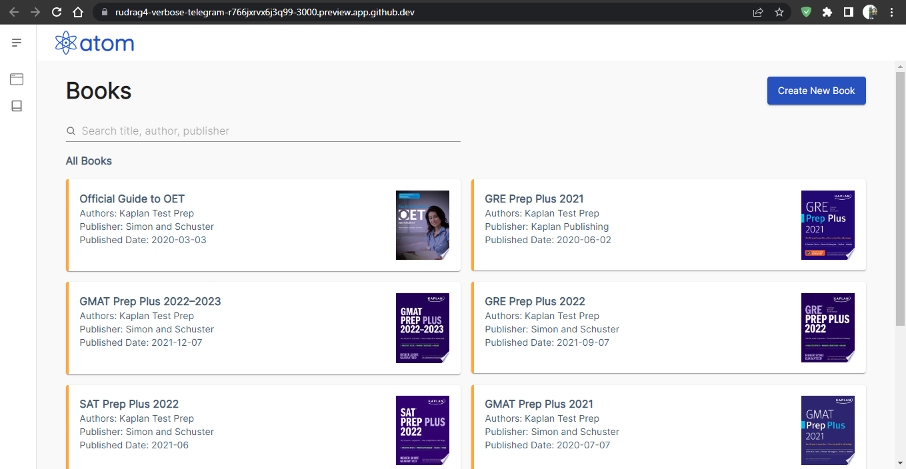

# atom-books

An Atom Book Search app created using React, Redux, React Router, Material UI


## Cloning the project

To clone the project run below command

```bash
  git clone https://github.com/RudraG4/atom-books.git
```

## Install Dependency

To install dependency run below command

```bash
  cd atom-books

  npm install
```

## Building the App

To build run below command

```bash
  npm run build
```

## Deploy the App

To deploy the app locally run below command

```bash
  npm install -g serve

  serve -s build
```

## Screenshots



